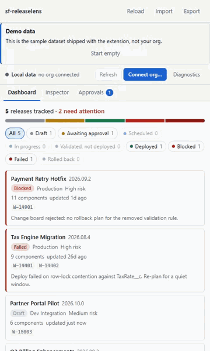
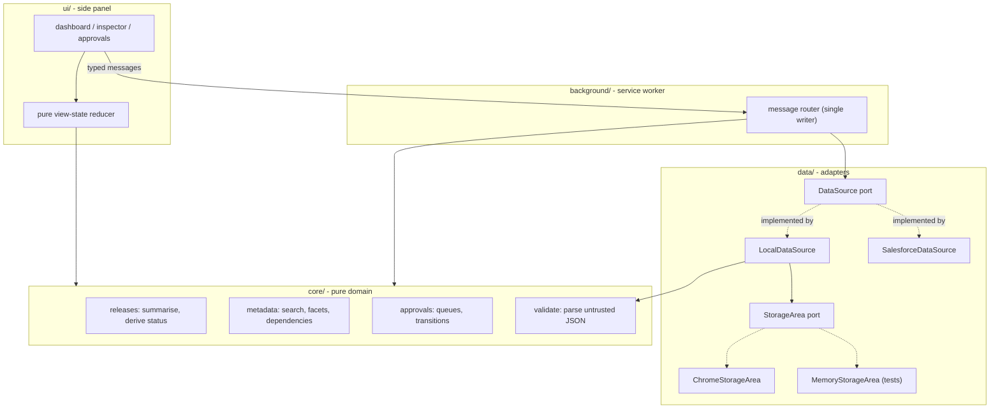

# sf-releaselens

A Manifest V3 Chrome side panel that joins Salesforce release status, deployment metadata
and promotion approvals into one surface, so a release manager stops reassembling them from
four browser tabs.

[](https://github.com/muraliseelam/sf-releaselens/actions/workflows/ci.yml)
[](https://github.com/muraliseelam/sf-releaselens/releases/latest)
[](LICENSE)

> **Status: pre-1.0, and never yet run against a live Salesforce org.** Everything below is
> either verified by tests or explicitly marked as unverified. Read
> [Limitations and known gaps](#limitations-and-known-gaps) before you rely on it.

## The problem

Tracking a promotion train across dev → UAT → production means holding four things in your
head at once, none of which talk to each other:

| Where the answer lives | The question it answers |
| --- | --- |
| Setup → Deployment Status, per org | Did the Friday deploy actually land? |
| `package.xml` / `sf project deploy` output | What is *in* this release? |
| Jira / Azure DevOps | Which work items does it cover? |
| A Slack thread | Has the change board signed off? |

The cost is concrete and recurring. A release manager running a fortnightly train answers
"which releases are blocked right now?" several times a day, and each answer costs minutes
of tab-switching. "Is `AccountTriggerHandler` in Friday's release, and what else depends on
it?" means opening a manifest and grepping. Worst of all, an approval waiting on one person
is invisible until cutover, because nobody has a list of what is pending *on them* — so the
block is discovered in the deployment window rather than three days before it.

sf-releaselens does not become a fifth system of record. It reads a snapshot you already
have — an `sf project deploy report --json`, or an export from a teammate — and makes its
state visible and actionable in one panel.

## Install

Not on the Chrome Web Store yet — see [`docs/STORE-LISTING.md`](docs/STORE-LISTING.md) for
what that still needs. Two ways to load it today, both unpacked.

**From a release** (nothing to build):

1. Download `sf-releaselens.zip` from the
   [latest release](https://github.com/muraliseelam/sf-releaselens/releases/latest) and
   unzip it.
2. Open `chrome://extensions`, turn on **Developer mode**, choose **Load unpacked**, and
   select the unzipped directory.

**From source** (what you want if you are going to read it, which you should):

```bash
git clone https://github.com/muraliseelam/sf-releaselens.git
cd sf-releaselens
npm install
npm run build
```

Then **Load unpacked** → the `dist/` directory.

Chrome 116 or later is required for the side panel API. The build is deterministic and
`npm run package` produces the same zip the release attaches, so you can rebuild a release
from its tag and compare it byte-for-byte against the published artefact.

## 60-second quickstart

1. Click the sf-releaselens toolbar icon. The side panel opens on the **Dashboard**, seeded
   with a demo dataset — five releases, ~57 components, seven approvals — and a banner
   saying so.
2. The headline reads `5 releases tracked · 2 need attention`. Click the red **Blocked**
   chip: one release, *Payment Retry Hotfix*, with a note explaining the change board
   rejected it.
3. Click that release. You land in the **Inspector**, already scoped to it. Type `payment`
   and select `PaymentGatewayAdapter` — the detail pane shows `55% covered`, a
   `HARDCODED_ID` warning, what it depends on, and what depends on it.
4. Open the **Approvals** tab. The badge shows the gates waiting on you. Approve one with a
   comment; the panel reports the decision *and* the release status change it caused, in
   place. Try rejecting one without a comment — it refuses, and keeps what you typed.
5. Press **Export** to download the snapshot as JSON, or **Import** to replace it with your
   own `sf project deploy report --json` output. **Start empty** on the demo banner clears
   the sample data.

## What it looks like

<!-- DEMO GIF: replace this whole block with the line below once the GIF exists.
      -->

Run it yourself, or generate the assets:

```bash
npm run assets
```

That drives the real extension in a real Chromium for about 40 seconds and writes
`build-assets/video/walkthrough.webm` plus eight screenshots — dashboard, filtered
inspector, component detail, an approval being recorded, and the *dependency data is not
available* state. Nothing is hand-composed, so nothing here can show a state the product
does not actually reach.

**The inline GIF is the one asset still missing**, because converting the video needs
ffmpeg and a human to look at the result.
[`docs/ASSETS.md`](docs/ASSETS.md) has the exact two commands and the size budget.

Still frames for the store listing come out of the same run:
[`docs/STORE-LISTING.md`](docs/STORE-LISTING.md) §3.

## Architecture

Four layers, one dependency direction. `core/` is pure TypeScript with no `chrome.*` and no
I/O, so every rule in the product is testable in Node without a browser or a mock framework.



Three decisions worth knowing before reading the code:

- **The service worker is the single writer.** Every mutation goes through one message
  router, which re-reads storage immediately before writing. Two open windows deciding the
  same approval produce a typed conflict error, not a silently lost write.
- **No bundler and no runtime dependencies.** `tsc` emits ES modules that Chrome loads
  natively in both the worker and the panel; the build is `tsc` plus a 90-line copy-and-
  verify script. The whole review surface for someone deciding to install this is the source.
- **A side panel, not a popup.** The dashboard and inspector are reference surfaces used
  *while* looking at an org tab, and a popup dismisses on outside click.

Full design rationale, data model and failure-mode table: [`docs/DESIGN.md`](docs/DESIGN.md).

## Measured numbers

Full table, at 100 / 1,000 / 10,000 components: [`docs/BENCHMARKS.md`](docs/BENCHMARKS.md).
Re-run it with `npm run bench` rather than trusting these; they are one run on one machine,
and they are **synthetic** — no live org has ever been measured.

At **1,000 components across 20 releases**, which is a large quarterly release:

| Operation | p50 | p95 |
| --- | ---: | ---: |
| Parse the stored snapshot | 0.52 ms | 0.96 ms |
| Render the dashboard | 2.36 ms | 4.19 ms |
| Render the inspector | 10.3 ms | 13.6 ms |
| Search, text + type + operation facets | 0.68 ms | 1.18 ms |
| Merge a refresh into the cache | 0.03 ms | 0.06 ms |

**Size and startup**, measured in a real Chromium: the packaged extension is **83.6 KB**
zipped (250 KB unpacked, 41 files, zero runtime dependencies), and the panel is readable
**225 ms** after opening — 239 ms if Chrome had evicted the service worker and has to start
it first. Both are budgeted and gated in CI; `npm run size` fails the build if the package
outgrows its budget.

The filtered search is the slowest core path because facet counts are computed three times —
once for the results, once per facet group with that group's own filter lifted — which is
what makes a facet chip's count trustworthy. The inspector caps rendering at 200 rows and
says so in the caption, which is why its render cost barely moves between 1,000 and 10,000.

Benchmarking found and fixed one real scaling bug: the dashboard computed each release's
component count by filtering the whole item list, once per row, which is quadratic in
(releases × components). See the "What changed as a result" section of the benchmarks.

Test coverage, from `npm run test:coverage`: **94.8% lines, 91.3% branches** across
`core/`, `data/`, the auth and message layers and the whole UI layer — **584 unit tests** in
30 files, plus **40 end-to-end checks** in a real Chromium. Every exported function has
direct tests; `main.ts`, `handlers.ts` and `service-worker.ts` are excluded because they are
`chrome.*` wiring with no logic of their own. CI fails below 90% statements or 85% branches,
so those numbers cannot quietly slide.

## Security and what this extension can see

Summarised here; the full threat model and the disclosure process are in
[`SECURITY.md`](SECURITY.md).

### Two modes, and the difference matters

| | **Local mode** (default) | **Org-connected mode** |
| --- | --- | --- |
| Where data comes from | The shipped **demo dataset**, or a file you imported | Your Salesforce org's deploy history |
| Network access | **None.** No host permission is granted. | `GET` only, to the one org you connected |
| Is the data real? | **No.** The five releases and 57 components in `src/data/seed.ts` are fictional. | Yes for releases and components; see the gaps below |
| Approvals | Local, unauthenticated | **Still local, still unauthenticated** |

The extension **installs requesting no host permissions at all** and cannot reach
any network until you connect an org, at which point Chrome prompts you for that
org's origin. Nothing is read from the org until you press **Refresh**: there is
no polling, no timer, and no background fetch anywhere in the codebase.

### It cannot write to your org

The interface used to reach Salesforce has `get` and two query methods, and no
`post`, `patch` or `delete` member. A contributor cannot give a read path a write
side effect without changing that interface, which is a visible diff in review. A
lint rule additionally restricts `fetch` to exactly two files — the org transport
and the OAuth token exchange — so every outbound request in the product is
visible in two files.

The OAuth scopes requested are `api` and `refresh_token`, and nothing else.

### Reporting a bug without leaking your org

The org strip has a **Diagnostics** button. It downloads a report built from
counts, versions, enums and durations — never copied from org data — so it is
safe to attach to a public issue. No token, Consumer Key, org name, instance
URL, username, deploy id, release name, component name, file path or approval
comment is in it, and the report prints that list on itself so you can check
rather than trust. `test/core/diagnostics.test.ts` asserts it against a payload
containing every one of them.

### Token handling

| Token | Where it lives | Survives browser close? |
| --- | --- | --- |
| Access token | Service-worker memory only. Never written to any storage area. | No |
| Refresh token | `chrome.storage.session` only — memory-backed, never written to disk. | No |
| Consumer Key | `chrome.storage.local`. A public identifier, not a secret. | Yes |

The **org data cache is written to disk** in `chrome.storage.local`, unencrypted,
like any extension storage. That is release names, deploy ids, component names
and coverage figures — org metadata, not record data, and never a credential. If
that is more than your policy allows on a laptop, use **Disconnect**, which
clears the token, or **Start empty**, which clears the cache.

There is no client secret: the extension is a PKCE public client and will not
accept one. Every auth error message passes through a three-layer redactor before
it reaches an `Error`, and a test asserts that no token value can appear in a
serialized error.

Auth is OAuth against a Connected App **you** create in your own org — see
[`docs/CONNECTED-APP.md`](docs/CONNECTED-APP.md). We deliberately do *not* publish
a shared Connected App, and we deliberately do *not* read a session out of an open
Salesforce tab.

For environments where even this is too much, `docs/DATASOURCE.md` §4 Option C
records a posture we have **not** built: a local companion process that shells out
to the `sf` CLI and inherits its auth, so the extension holds no credential at all.

### Approvals are not an audit trail

Connecting an org does **not** change this. Salesforce has no deployment-approval
object, so approvals stay entirely local: the "acting as" profile is a switcher,
not an authenticated identity, and any decision can be altered by exporting the
JSON, editing it, and importing it back. The extension never writes an approval —
or anything else — to your org.

If you need an approval trail that stands up to an audit, this is not it, and
saying otherwise would make it worse than the Slack thread it replaces.

### Permissions

| Permission | Why |
| --- | --- |
| `storage` | The snapshot, the org cache, and the Consumer Key. |
| `sidePanel` | Opening the panel from the toolbar icon. |
| `identity` | The OAuth flow, via `chrome.identity.launchWebAuthFlow`. |
| `optional_host_permissions` | Requested **only** when you connect an org. Never granted at install. |

No content scripts. No `tabs` permission. The extension cannot read the page you
are on.

## Accessibility

The panel is usable with a keyboard alone, and its ARIA contract is unit-tested
rather than assumed:

- **Tab strip** follows the ARIA tabs pattern — one Tab stop for the whole strip,
  arrow keys to move, Home and End to jump, selection following focus.
- **Focus survives a re-render.** The panel rebuilds its body on every state
  change and restores focus by id, so activating a chip, a row or an approval
  leaves you where you were. When the control you were on genuinely disappears —
  an approved card moving to the decided queue — focus moves to the notice that
  explains what happened, not to the top of the panel.
- **Two live regions**, created once outside the rebuilt subtree, so they still
  announce: polite for counts and outcomes, assertive for failures. Identical
  text is never rewritten, so typing in the search box stays silent.
- **Names, not positions.** Every "Approve" button says what it approves; every
  chip count says what it counts; decorative elements are hidden from the
  accessibility tree.

What is *not* verified: how any of it actually sounds. Nobody has run this
through NVDA or VoiceOver — see §7a of `docs/QA-CHECKLIST.md` for what that
leaves open.

## Configuration

Data gets in four ways:

| Input | Notes |
| --- | --- |
| Demo dataset | Seeded on first run in local mode. Fictional. Replaceable with **Start empty**. |
| A previous export | **Import** → any `.json` this extension exported. Your local profile is preserved rather than overwritten by the exporter's. |
| `sf project deploy report --json` | **Import** → the same button detects the shape. |
| A connected org | **Connect org…**, then **Refresh**. Reads `Organization`, recent `DeployRequest` records with their components, and `ApexCodeCoverageAggregate`. |

Development commands:

```bash
npm run build          # tsc + copy assets + verify every manifest path exists
npm run test           # vitest, ~5 seconds
npm run test:coverage  # vitest with v8 coverage thresholds
npm run test:e2e       # real Chromium with dist/ loaded, ~90 seconds
npm run size           # fail if the packaged extension outgrew its budget
npm run lint           # eslint, type-checked rules
npm run check          # everything except the browser suite
node bench/bench.mjs   # the numbers above (needs a build first)
```

`test:e2e` is deliberately outside `check`: the unit suite runs in about five
seconds and is what you run on every save, and a browser suite that slow gets
skipped. CI runs it as its own job, and a release cannot be cut unless it
passes.

## Limitations and known gaps

Stated plainly, because they determine whether this is useful to you:

- **Approvals are a workflow aid, not an auditable control.** There is no server, so the
  "acting as" profile is not authenticated and a decision is local state its owner could
  edit by exporting, changing the JSON and re-importing. If you need an approval trail that
  stands up to an audit, this is not it, and pretending otherwise would be worse than the
  Slack thread it replaces.
- **Never tested against a live Salesforce org.** The org integration is complete and fully
  unit-tested against a fake connection, but nobody has yet pointed it at a real org.
  [`docs/LIVE-ORG-RUNBOOK.md`](docs/LIVE-ORG-RUNBOOK.md) is the exact sequence for doing it,
  including what is most likely to break first; `docs/QA-CHECKLIST.md` §9 tracks what stays
  unverified until someone does.
- **Nothing is shared between machines.** Two people running this see two independent
  snapshots. Sharing means exporting and importing a file.
- **No dependency graph from an org or a deploy report.** Both list components, not edges.
  Org-sourced and imported components therefore carry *no* dependency data, and the
  inspector says so rather than showing an empty list — "unknown" and "none" are different
  answers, and the second would tell you a component is safe to change. Only the demo
  dataset has edges.
- **Org releases show a deploy id until you name them.** Salesforce has no release name, so
  a local overlay keyed by deploy id supplies one; with no entry the deploy id is shown, and
  a name is never invented. **There is no UI to edit that overlay yet** — it is read from
  `chrome.storage.local` under `sf-releaselens.release-overlay.v1`.
- **`riskLevel` is a local judgement.** The org has no such field; it is defaulted from the
  deploy outcome.
- **A refresh reads the ten most recent deployments**, at one API call each plus three more.
  Older releases stay in the cache but are not re-read. A refresh is refused outright if the
  org is at or above 95% of its daily API budget.
- **Coverage is only as good as the snapshot.** Unknown coverage renders as "Coverage
  unknown" and is never shown as 0%, but nothing here computes coverage.
- **Chrome's own side-panel frame is not automated.** `npm run test:e2e` loads the built
  extension into a real Chromium and drives the panel document at the extension origin, but
  there is no automation surface for the browser's toolbar icon or the side-panel container
  itself. That the icon opens the panel, and that the panel is legible at the width Chrome
  gives it, are still human checks.
- **No demo recording.** See "What it looks like" above; the screenshots and the GIF are
  both still to be captured by a human.
- **The inspector renders at most 200 rows** per result set. The count is shown, but the
  201st component is only reachable by narrowing the filters.

## Contributing

Issues and pull requests are welcome. [`CONTRIBUTING.md`](CONTRIBUTING.md) covers the
layout, the non-negotiables and how commits become releases; the pull request template
lists what CI will check before a human looks at it.

Found a security issue? **Do not open a public issue.** Follow
[`SECURITY.md`](SECURITY.md), which also contains the full threat model — what this
extension can reach, what it stores and where, and what it explicitly does not protect you
from.

## Licence

MIT — see [LICENSE](LICENSE).
