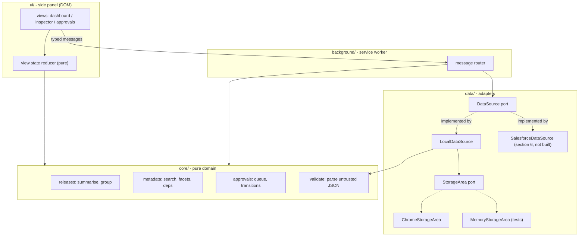

# sf-releaselens — Design

A Manifest V3 Chrome extension that gives a Salesforce release manager one side panel
for the three questions asked all day: *what is in flight*, *what exactly is in this
release*, and *what is waiting on me*.

Status: **implemented in v0.1.0.** Sections marked *(as built)* record where the
implementation departed from this document; the rest was built as written.

---

## 1. Problem

A Salesforce release manager tracking a promotion train across dev → UAT → prod
currently reconstructs its state from four places: Setup → Deployment Status in each
org, a `package.xml` or `sf project deploy` manifest, a Jira/ADO board, and a Slack
thread where approvals actually happen. Nothing joins them. The recurring costs:

- **Status is reassembled by hand.** "Which releases are blocked right now?" takes
  minutes of tab-switching per ask, several times a day.
- **Component-level questions are unanswerable fast.** "Is `AccountTriggerHandler`
  in the Friday release, and what depends on it?" means grepping a manifest.
- **Approvals stall silently.** A promotion sits waiting on one reviewer who has no
  single list of what is pending on them, so the block is discovered at cutover.

Scope of v1 is deliberately narrow: make the state **visible and actionable in one
surface**, without becoming another system of record that must be kept in sync.

## 2. Scope

| In | Out (v1) |
| --- | --- |
| Release dashboard summarising releases by status | Triggering real deployments |
| Metadata inspector: search / filter / detail | Editing metadata or writing to an org |
| Approvals helper: list pending, approve / reject | Real identity — the actor is a local profile, not SSO |
| Local-first persistence + JSON import/export | Live Salesforce API calls (boundary defined, §6) |

**Honest limitation, stated up front:** approvals recorded here are a *workflow aid*,
not an auditable control. There is no server, so a decision is trusted local state
that its owner could edit. §6 describes what changing that would require.

## 3. Architecture

Four layers, one dependency direction. `core/` is pure TypeScript with no `chrome.*`
and no I/O, so every rule in it is testable without a browser or a mock framework.



**Why a service worker at all**, when the panel could read storage directly: it owns
the single writer. All mutations funnel through one router, so a decision made in the
panel and a decision replayed from an import cannot interleave into a torn snapshot.
It also owns `sidePanel.setPanelBehavior` and the `chrome.storage.onChanged` fan-out
that lets an open panel re-render when another surface writes.

**Why a side panel rather than a popup:** the dashboard and inspector are reference
surfaces used *while* looking at an org tab. A popup dismisses on outside click, which
makes "read the component list, check the org, come back" impossible.

**Why no bundler:** `tsc` emits ES modules that Chrome loads natively in both the
service worker (`"type": "module"`) and the panel page. The build is `tsc` plus a
short copy script. Runtime dependency count: zero.

### Module map

```
src/
  core/       types · errors · clock · releases · metadata · approvals · validate
  data/       datasource (port) · storage (port) · local · seed · transfer
  background/ service-worker · router · messages (protocol)
  ui/         sidepanel.html · main (bootstrap) · panel · state · views/* · dom
              client · format · handlers
```

Dependency injection over singletons throughout: `createLocalDataSource({ storage,
clock, newId })`. Tests pass `MemoryStorageArea`, a fixed clock, and a counter-based
id factory, so assertions are on exact values, not shapes.

## 4. Data model

One `Snapshot` is the unit of persistence and the unit of import/export.

```ts
type ReleaseStatus =
  | 'draft' | 'scheduled' | 'awaiting_approval'
  | 'in_progress' | 'deployed' | 'blocked' | 'failed' | 'rolled_back';

interface Environment { id; name; kind: 'scratch' | 'sandbox' | 'production'; orgAlias }

interface Release {
  id; name; version;                 // e.g. "2026.09.3"
  status: ReleaseStatus;
  targetEnvironmentId: EnvironmentId;
  owner; createdAt; updatedAt; scheduledFor?;
  ticketRefs: string[];              // "W-12345", "REL-88"
  riskLevel: 'low' | 'medium' | 'high';
  notes?;
}

interface MetadataItem {                       // one component in one release
  id; releaseId;
  fullName;                                    // "AccountTriggerHandler"
  type: MetadataType;                          // ApexClass, Flow, CustomObject, ...
  operation: 'add' | 'modify' | 'delete';
  filePath; apiVersion;
  lastModifiedBy; lastModifiedAt;
  dependsOn: string[];                         // fullNames, resolved lazily
  testCoverage?: number;                       // 0..1, absent is not zero
  warnings: MetadataWarning[];                 // { code, message, severity }
}

interface Approval {
  id; releaseId; stage;                        // "UAT sign-off"
  requiredRole; requestedBy; requestedAt;
  status: 'pending' | 'approved' | 'rejected' | 'cancelled';
  decision?: { by; at; comment? };
}

// (as built) The validator enforces the invariant the type cannot: a decided
// approval must carry a decision, and a pending one must not.

interface Snapshot {
  schemaVersion: 1;
  environments; releases; items; approvals;
  auditLog: AuditEntry[];                      // append-only, local
  actor: { name; roles: string[] };            // who "I" am for approvals
  isDemoData: boolean;                         // (as built) so the panel can say so
}
```

Notes on shape:

- **`schemaVersion` is present from day one.** `validate.ts` refuses an unknown
  version with a named, actionable error rather than partially loading it.
- **`dependsOn` stores `fullName`, not id.** A dependency frequently points at a
  component *not* in this release — that is exactly the interesting case ("this
  release modifies something UAT depends on"), and an id would force a null.
- **`testCoverage?` is optional, never defaulted to 0.** Unknown coverage and zero
  coverage lead to opposite decisions; conflating them is the kind of silent
  degradation the correctness posture forbids.
- **Relations are ids, not nesting.** Selection state in the UI is then an id, and a
  re-render after a mutation cannot show a stale embedded copy.

### Core algorithms

**Dashboard summary** — `summariseByStatus(releases)`: one pass, `O(n)`, returning
counts for every status (including zeros, so the UI does not shift as data changes),
plus `total` and `needsAttention` (`blocked + failed + rolled_back`). Buckets are
derived on read, never stored.

**Inspector search** — `searchMetadata(items, query)`: case-insensitive substring
across `fullName`, `type`, `filePath` and `lastModifiedBy`, AND-combined with facet
filters (`types[]`, `operations[]`, `releaseId`, `onlyWithWarnings`). Free text is split
on whitespace and every token must match, so a second word narrows rather than widens.
Returns matches plus `facets` — counts computed against the *other* active filters, so a
facet never advertises a count that would yield an empty result. `O(n·f)`; n is a release
payload (hundreds to low thousands), so no index is warranted and none is built.
*(as built)* The facet guarantee costs three passes over the candidate set — one for the
results and one per facet group with that group's own filter lifted. Measured at 5.7 ms
p50 over 5,000 components, which is the slowest path in the extension; see the README.

**Dependency view** — for a selected item, `resolveDependencies(items, item)` returns
`{ resolved, external }` (dependencies present vs absent in the snapshot) and
`dependents` (reverse edges), built per call from a `Map`, `O(n)`.

**Approval transitions** — `decideApproval(approval, decision, actor, now)` is a pure
state machine. Legal: `pending → approved | rejected | cancelled`. Anything else
throws `InvalidApprovalTransitionError` naming the approval, its current status, the
attempted one and who decided it first. Authorisation is a separate pure predicate,
`canDecide(approval, actor, outcome)`, so "not allowed" and "not possible" stay distinct
failures with distinct messages — and decidability is checked *first*, so someone without
the role is told the real reason rather than a misleading one.
*(as built)* `canDecide` grants one exception beyond the required role: the person who
raised a request may always withdraw it, since cancelling your own request is not a
privileged act.

**Release status derivation** — after a decision, `deriveReleaseStatus(release,
approvals)` applies, in order: any `rejected` → `blocked`; any `pending` →
`awaiting_approval`; all decided and none rejected → `scheduled`. It only ever moves a
release out of `draft` / `awaiting_approval` / `blocked`. It will not overwrite
`in_progress`, `deployed`, `failed` or `rolled_back`, which are facts about an org,
not opinions about one. Every transition appends an `AuditEntry`.

## 5. UI flow

Three tabs in one side panel; selection lives in one `ViewState` reduced by a pure
`reduce(state, action)`.

```
+-- sf-releaselens ---------------+
| [Dashboard] Inspector Approvals |  <- badge on Approvals = pending for me
+---------------------------------+
| 12 releases - 3 need attention  |
| ####------  status bar          |
| deployed 5 - awaiting 3 - ...   |  <- click a status chip -> filtered release list
|                                 |
| Releases                        |
| > 2026.09.3  UAT   awaiting (2) |  <- click -> Inspector, pre-filtered
| > 2026.09.2  PROD  blocked  (!) |
+---------------------------------+
```

- **Dashboard → Inspector:** clicking a release sets `inspector.releaseId` and
  switches tabs, so "what is in this?" is one click, not a re-search.
- **Inspector:** search box + facet chips + result list; selecting a row opens a detail
  pane with fields, warnings, dependencies and dependents. Dependents are clickable, so
  impact is walkable.
  *(as built)* The search is **not** debounced. Search text lives in the reducer, so a
  debounce would leave the input visibly lagging its own state; at the measured cost —
  5.7 ms p50 for a filtered search over 5,000 components — every keystroke can re-render
  inside a frame. The result list is instead capped at 200 rendered rows, with the cap
  stated in the caption rather than applied silently.
- **Approvals:** pending for the current actor first, then other pending, then
  recently decided. Approve / Reject open a comment field; Reject *requires* a
  comment. After a decision the affected release's new status is shown inline — the
  consequence appears where the action happened.

**Loading and error states are per view**, not one global spinner:
`idle → loading → ready | error`. `error` renders the thrown error's message (they are
written to be read by a human) plus a Retry that re-issues the same message. An empty
result renders a distinct empty state naming the filter that caused it and offering to
clear it — an empty list and a failed load never look alike.

Mutations are not optimistic: the panel disables the acting control, awaits the
worker's response, and re-renders from the returned snapshot. At this data size the
round trip is sub-frame, and it removes a whole class of rollback bugs.

## 6. The Salesforce boundary

v1 ships `LocalDataSource` only. The boundary is defined now so it does not have to be
retrofitted:

```ts
interface DataSource {
  load(): Promise<Snapshot>;
  applyApprovalDecision(input: DecisionInput): Promise<Snapshot>;
  importSnapshot(raw: unknown): Promise<Snapshot>;
  exportSnapshot(): Promise<Snapshot>;
  reset(seed: 'empty' | 'demo'): Promise<Snapshot>;
}
```

Everything above `data/` depends on this interface and nothing else. A future
`SalesforceDataSource` would satisfy it by mapping `DeployRequest` (Tooling API) →
`Release` and its `componentSuccesses` / `componentFailures` → `MetadataItem`. It
would additionally need: OAuth via `chrome.identity`, `host_permissions` for the org
domain, retry-with-backoff on 429/503, and an explicit decision about where approvals
live — Salesforce has no native deployment-approval object, so they would stay local
or move to a real backend. That last point is why it is not in v1: a half-real
approval trail is worse than an openly local one.

The interim path that needs no backend is `importSnapshot`: paste the JSON from
`sf project deploy report --json`, mapped by `data/transfer.ts` through the same
validator as stored data.

## 7. Failure modes and fallbacks

| Failure | Behaviour |
| --- | --- |
| `chrome.storage` empty (first run) | Seed with the demo snapshot; a banner states it is demo data and offers Reset to empty. |
| Stored JSON unparseable / unknown `schemaVersion` | **Do not** silently reset. Surface `SnapshotValidationError` naming the field, and offer *Export raw* then *Reset*. Unreadable user data is never destroyed automatically. |
| Import file malformed | Rejected whole; the existing snapshot is untouched. Partial import is never attempted. |
| Import replaces the actor | *(as built)* The current local profile is carried across an import, so opening a colleague's export does not silently change which gates you appear able to decide. |
| Decision on an already-decided approval (two panels open) | The worker re-reads before writing; the transition throws `InvalidApprovalTransitionError`, the panel reports "already decided by X" and re-renders. Last-write-wins is not used. |
| `storage.local` quota exceeded | Typed error naming the byte size, with Export offered so nothing is lost. |
| Dependency naming a missing component | Rendered as `external`, plainly labelled — not hidden, not an error. |

No `catch {}` anywhere; every catch either handles or rethrows a typed error from
`core/errors.ts`, each carrying the offending id or field name.

## 8. Testing

Vitest, matching the workspace convention. Targets: `core/` ≥ 95 % lines (it is pure —
anything less means a rule is unexercised), overall ≥ 85 %.

- **Unit, `core/`:** summary counts incl. all-zero and single-status; search across
  each field, case-insensitivity, facet counts under other active filters, empty
  query; dependency resolution with missing, self- and cyclic references; every legal
  and illegal approval transition; `deriveReleaseStatus` precedence and its refusal to
  overwrite org-fact statuses; the validator against a dozen malformed payloads.
- **Integration, `data/`:** `LocalDataSource` over `MemoryStorageArea` with a fixed
  clock — seed → decide → export → import round-trips to a deep-equal snapshot;
  concurrent decision rejected; quota error surfaced.
- **Fixture:** one realistic 3-release / ~60-component snapshot in `test/fixtures/`,
  used by the integration tests so assertions read against plausible Salesforce names,
  not `foo` / `bar`.
- No network and no live org in tests. `chrome.storage` is reached only through the
  `StorageArea` port, which is substituted; the panel talks to a stub `Client` rather
  than to `chrome.runtime`. The one place a `chrome` global appears is
  `test/ui/client.test.ts`, which is the unit test *for* that boundary.
- *(as built)* The DOM layer is tested under jsdom (`@vitest-environment jsdom` per
  file), which is the project's only test-time dependency. `ui/main.ts` was split out
  of `ui/panel.ts` so the controller has no module-level side effect and can be started
  against a stub client.

## 9. Increments

1. `core/` types, errors, pure logic + unit tests
2. `data/` ports, `LocalDataSource`, seed, validate, transfer + integration tests
3. `background/` router and typed message protocol
4. `ui/` side panel — dashboard, inspector, approvals, with loading / error / empty states
5. manifest, build script, README, LICENSE, CONTRIBUTING, CI

All five shipped in v0.1.0: 343 tests, 96.7% line coverage over `core/`, `data/`, the
message layer and the UI.

## 10. What changed during implementation

Three things this document got wrong, recorded rather than quietly corrected:

1. **The debounce was a mistake.** Holding search text in the reducer and debouncing the
   input means the box lags its own state. Removed; a 200-row render cap replaced it.
2. **Carrying the actor across an import was specified but not implemented** in the first
   pass — `parseImportText` returns the imported file verbatim, actor included. Caught by
   a router test that asserted the documented behaviour, and fixed in the router.
3. **Comment drafts had to move into view state.** They started in the DOM, which meant a
   full re-render after "rejection requires a comment" discarded the half-written comment
   the error was asking for.
